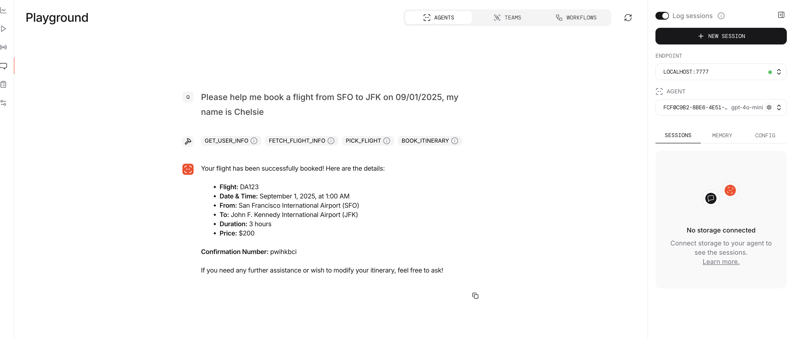
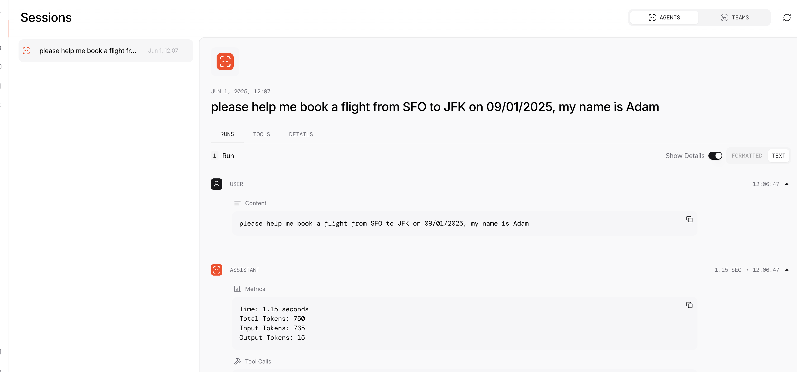

# Agno

This report is based on my experience of building the following programs with Agno:

- An airline service agent, which can help users book and manage flights. It's a tool calling agent based on ReAct.

Agno is specialized for building agents, so I am skipping the non-agent use cases.

## Overview

In short, my comment of Agno is one word: **Elegant**.

Feature overview, from what I can find:

| Feature                                          | Supported?           | Dev Experience Or Comment    |
|--------------------------------------------------|----------------------|------------------------------|
| Agent API                                        | Y                    | Good                         |
| Prompt Writing Helper                            | N                    |                              |
| Client Cache                                     | N                    |                              |
| Tracing                                          | Y                    | Good                         |
| Output Token Streaming                           | Y                    | Very Good                    |
| Intermediate Streaming (Tool calling message) | Y                    | Very Good                    |
| Intermediate Token Streaming                     | N                    | didn't try                   |
| Structured Output, e.g., Pydantic as output      | Y                    | didn't try                   |
| Save/Load                                        | N                    |                              |
| Automatic Prompt Optimization                    | N                    |                              |
| Runnable in Ipython                              | Y                    | Good                         |

Workflow experience:

| Workflow Name                                             | Developer Experience |
|-----------------------------------------------------------|----------------------|
| Build an Airline Service Agent, which has tool calling | Good                 |
| Get streaming to work                                     | Good                 |
| Generate trace and debug with trace                       | Good                 |
| Switch LM behind the scene                                | Good                 |
| Put demo up by reading the documentation                  | Good                 |
| I love the code                                           | Good                 |

## Comment

### Elegant Developer and User Experience

The agent API is very clean and easy to use, and it's pretty straightforward to add custom tools.
Extra kudos to the streaming experience, the console logging is super elegant. So overall building
agent with Agno is a pleasant experience.

### Powerful Agent Support and Clean Documentation

Aside from the code I checked in, Agno supports other features for agent building like memory (conversation history),
knowledge (custom data) and etc. From my trial of these features, it's pretty straightforward to put them up by
simply reading the doc.

### Fantastic Playground

Agno comes with a built-in playground, which is a web app that allows you to test your agent. The
[setup documentation](https://docs.agno.com/introduction/playground) can use some improvements by explaining how to
set up the playground instead of just showing the code, but the playground feature works fantastically.

### Decent Tracing UI 

Tracing is supported out of the box, but I feel I like the langsmith tracing UI better.

The space between sections is a bit too big, and I cannot easily collapse individual sections to focus on the part
I am interested in. But overall it's still a decent UI.

### Limited to Agent Use Cases

If there is one major weak point of Agno, it's that it's limited to agent use cases. At least from my reading, 
if you want to build a multi-stage program, you are out of luck. My main concern is that if one day
tool-based agent is not the standard, but I have adopted Agno widely in my codebase, then the migration
could be an issue.

## Conclusion

Agno is an elegant framework for building tool-calling agents. I do recommend giving it a try if your use
case can be covered by tool-calling agents.
