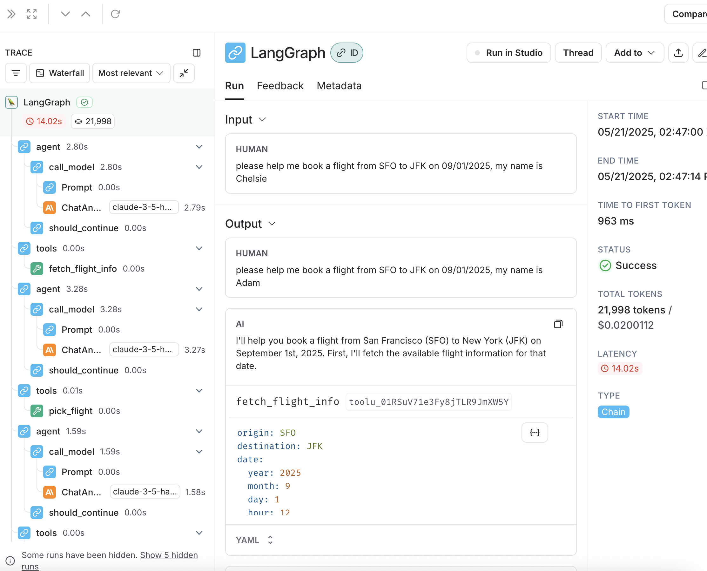

# LangChain and LangGraph

This report is based on my experience of building the following two programs with LangChain and LangGraph:

- An airline service agent, which can help users book and manage flights. It's a tool calling agent based on ReAct.
- A random multi-stage program, which first answers user's question, then score the answer with LLM in 0-10.

Because from the official LangChain doc, it highly recommends using LangGraph, I am focusing the code on LangGraph.

## Overview

Feature overview, from what I can find:

| Feature                                          | Supported?           | Dev Experience Or Comment    |
|--------------------------------------------------|----------------------|------------------------------|
| Agent API                                        | Y                    | Good                         |
| Prompt Writing Helper                            | A bit                |                              |
| Cache                                            | Y                    | Automatic, little visibility |
| Tracing                                          | Y                    | Very Good                    |
| Output Token Streaming                           | Y                    | Good                         |
| Intermediate Streaming (Tool calling message) | Y                    | Good                         |
| Intermediate Token Streaming                     | Y                    | didn't try                   |
| Structured Output, e.g., Pydantic as output      | Maybe                | Parser doesn't work          |
| Save/Load                                        | N                    |                              |
| Automatic Prompt Optimization                    | N                    |                              |
| Runnable in Ipython                              | Y                    | Good                         |

Workflow experience:

| Workflow Name                                             | Developer Experience |
|-----------------------------------------------------------|----------------------|
| Build an Airline Service Agent, which has tool calling | Good                 |
| Build a multi-stage program                               | Very frustrating     |
| Get streaming to work                                     | Good                 |
| Generate trace and debug with trace                       | Very good            |
| Switch LM behind the scene                                | Decent               |
| Put demo up by reading the documentation                  | Frustrating          |
| I love the code                                           | Neutral              |

## Comment

### Good ReAct Experience Overall

It's a decent experience of building the airline service agent, as LangGraph provides
an easy way `create_react_agent` to hook custom tools to LLM calls. Custom tools can
simply be python function with the `tool` decorator. LangSmith integration is super
solid, it's almost effortless to get my program traced, and the trace UI is very neat:
ls

I also played with streaming feature and it works pretty well (code not checked in though). Another kudos
to the fact that I can run everything in IPython notebook, e.g., Colab, Jupyter, etc.

### Lots of Magic Configs

However, even though the ReAct experience is good overall, there are a few magic setups
that make me feel uncomforable. For example, the `config` arg when running `agent_executor.invoke`
doesn't have an explanation from [the official doc](https://python.langchain.com/docs/tutorials/agents),
and removing it doesn't crash the code. Similar things happen to `stream_mode` arg, I just
found out that I can do `"messages"` or `"values"`, but I have no idea what I am doing.

### Frustrating Experience of Writing a Multi-stage Program

Authoring the `multi_stage_program.py` is much more frustrating than necessary. All I want to do
is chaining a few submodules that do LLM calls, but langgraph makes it extremely hard. Part of this
is because of the unclear meaning of `State`. I eventually didn't find explanation on what should be
set, but use my engineer instinct to guess the meaning of the class. Part of the bad experience is
also due to the native that langgraph has a poor support for structured output. Seems like the
[parser](https://python.langchain.com/docs/concepts/output_parsers/) could do the job, but I spend 1.5h
on this field and got no luck.

I am aware that I can just do a few `llm.invoke()`, but I will lose the perks promised by langgraph, and
there is no point for me to use `llm.invoke()` from langgraph ecosystem than the vanilla OpenAI SDK.

## Conclusion

The framework feels heavy for me, it's like I have to follow the user workflow they define for me (`create_react_agent`),
otherwise it will be hard to get my code working by digging through the documentation, even the source code.

So if I know my work can be done via a ReAct agent, I will consider using langgraph ecosystem. If I want to be flexible
and try out different things, I won't bother.
